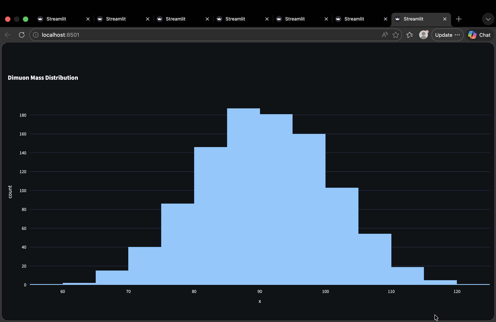
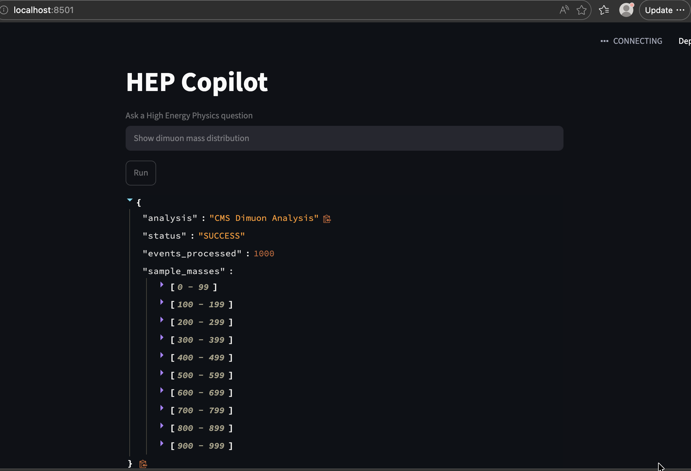
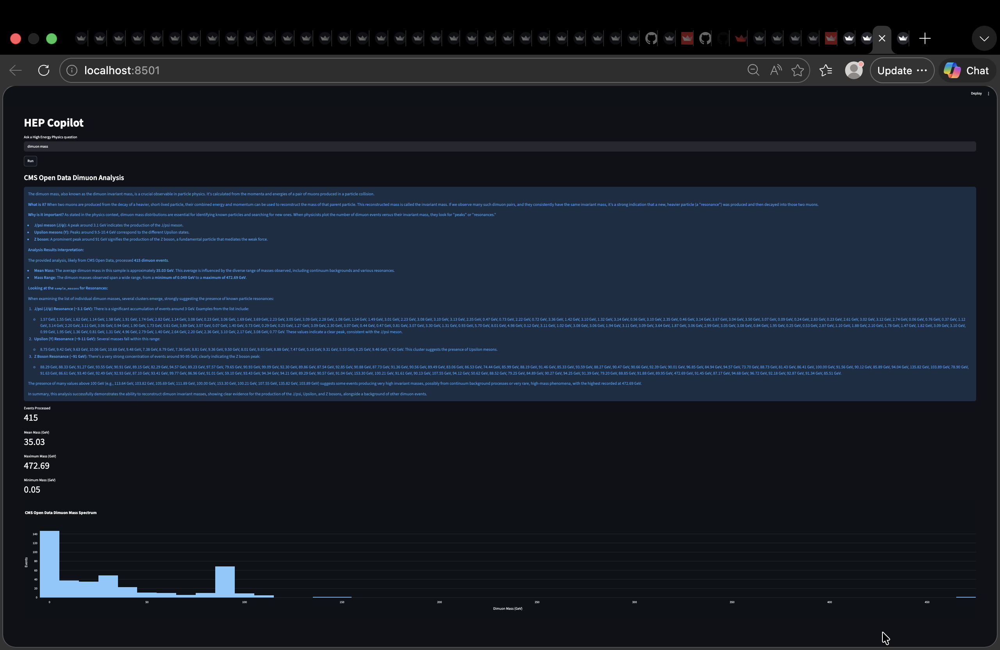
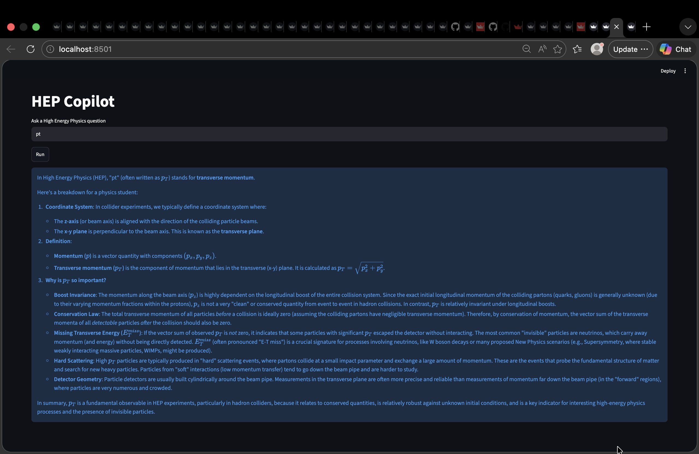
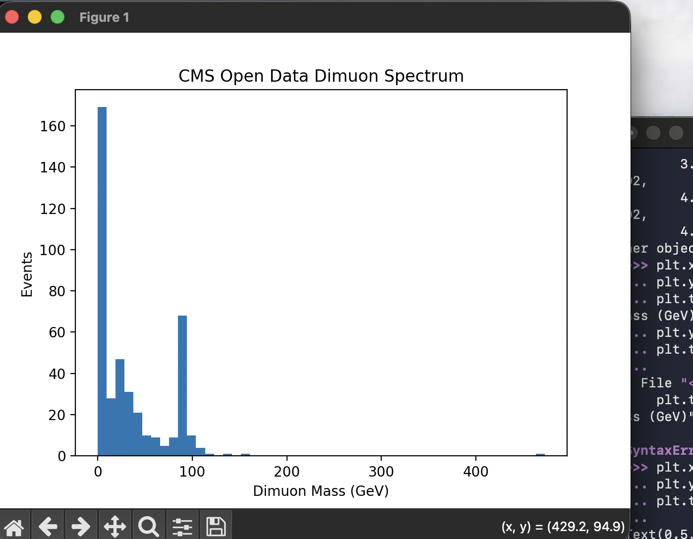

# 🔬 HEP Copilot

### AI-Powered High Energy Physics Research Assistant

HEP Copilot is an intelligent research assistant that combines **Google Gemini**, **CMS Open Data**, and **interactive scientific analysis** to enable natural language exploration of High Energy Physics (HEP) datasets.

Users can ask physics questions, perform real CMS data analyses, visualize particle distributions, and receive AI-generated explanations through a simple web interface.

---


## 🚀 Overview

HEP Copilot is an AI-powered platform that enables users to interact with real CERN CMS Open Data using natural language.

Instead of manually writing complex analysis scripts, users can ask questions such as:

* *What is a muon?*
* *Show the dimuon mass distribution.*
* *Why is there a peak near 91 GeV?*
* *How does the CMS detector identify particles?*

The system automatically routes queries, performs data analysis when required, generates visualizations, and provides AI-powered explanations.

## 🚀 Live Demo

🔗 **Website Application:**
https://hepcopilot.streamlit.app/

🔗 **Reading CMS open Data using uproot:**
https://youtu.be/a93RbPCuylk?si=XUot8xZxB29GHdqC

🔗 **HEP Copilot prototype video**
https://youtu.be/hWy2R1G_4is?si=tFZsjqRAAjoOoN8b

---

## 📸 Screenshots

### Main Interface version 1.0 (NanoAODRun1 2012 Open Data )




### Main Interface version 2.0



### AI Physics Explanations



### CMS Open Data Analysis




## ✨ Key Features

### 🤖 AI Physics Assistant

* Powered by Google Gemini
* Natural language interaction
* Physics concept explanations
* Research-oriented responses
* Educational guidance for beginners

### 🔬 Real CMS Open Data Analysis

* CERN CMS Open Data integration
* Dimuon analysis
* Muon analysis
* Electron analysis
* Jet analysis
* Physics event exploration

### 📊 Interactive Visualizations

* Histogram generation
* Mass spectrum analysis
* Particle distribution plots
* Interactive Plotly visualizations

### ☁️ Cloud Deployment

* Streamlit-powered web application
* Accessible from any browser
* Interactive and responsive interface

---

## 🏗️ Architecture

```text
User Query
     │
     ▼
Google Gemini
     │
     ▼
Query Router
     │
 ┌───┼───────────┐
 │   │           │
 ▼   ▼           ▼
Muon Electron Dimuon
 │     │         │
 └─────┼─────────┘
       ▼
CMS Open Data
       ▼
Physics Results
       ▼
AI Explanation
       ▼
Interactive Dashboard
```

---

## 📂 Project Structure

```text
HEP--COPILOT/

├── app/
│   └── streamlit_app.py

├── analysis/
│   ├── copilot.py
│   ├── router.py
│   ├── llm.py
│   ├── memory.py
│   ├── explainer.py
│   └── modules/
│       ├── dimuon.py
│       ├── muon.py
│       ├── electron.py
│       └── jets.py

├── config/
│   └── settings.py

├── rag/
│   └── retrieval.py

├── requirements.txt
└── README.md
```

---


---

## 🛠️ Technology Stack

| Category        | Technologies                  |
| --------------- | ----------------------------- |
| AI              | Google Gemini                 |
| Frontend        | Streamlit                     |
| Visualization   | Plotly                        |
| Data Processing | NumPy, Pandas                 |
| HEP Analysis    | Uproot, Awkward Array, Coffea |
| Vector Database | ChromaDB                      |
| Embeddings      | Sentence Transformers         |
| Dataset         | CMS Open Data                 |

---

## 🌍 Why This Project Matters

High Energy Physics datasets contain enormous scientific value but often require significant domain knowledge and programming expertise.

HEP Copilot lowers the barrier to entry by combining modern AI capabilities with real experimental data, enabling students, educators, and researchers to interact with particle physics through natural language.

This project demonstrates how Large Language Models can accelerate scientific discovery, education, and data accessibility.


### Making High Energy Physics Accessible Through Artificial Intelligence 🚀🔬
